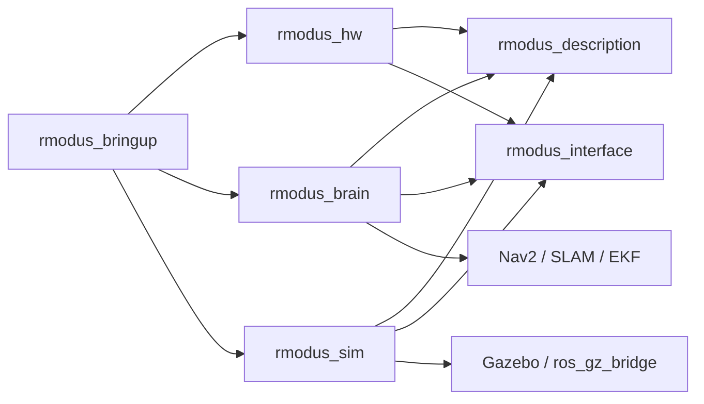
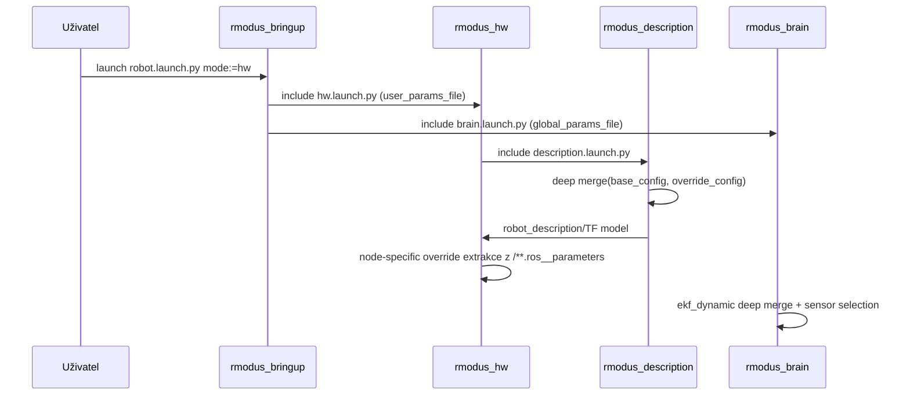
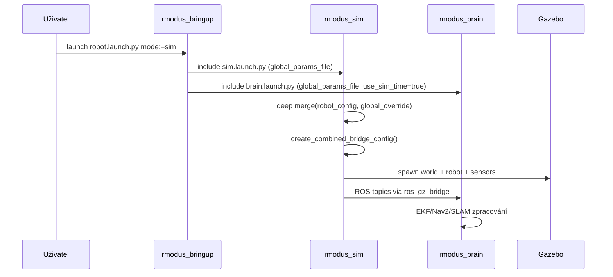

# R-Modus: Architektura, Konfigurace a Režimy Spuštění

## 1. Úvod a cíl dokumentu

Tento dokument podrobně popisuje architekturu navigačního software stacku v repozitáři `sw-nav-module`, se zaměřením na balíčky rodiny `rmodus_*`, jejich vzájemné vazby, tok parametrů a rozdíly mezi samostatným spuštěním a spuštěním přes centralizovaný bringup.

Cílem je poskytnout textový podklad vhodný pro diplomovou práci v technickém stylu. Text je proto psaný nejen jako stručný výpis funkcí, ale jako souvislé vysvětlení návrhových rozhodnutí, datových toků a praktických provozních scénářů.

Dokument vychází z aktuálního stavu workspace. V aktuálním rootu jsou přítomny balíčky:

- `rmodus_interface`
- `rmodus_description`
- `rmodus_hw`
- `rmodus_brain`
- `rmodus_sim`
- `rmodus_bringup`

V některých launch souborech jsou reference na externí balíčky (typicky instalované v ROS prostředí mimo tento repozitář), například `slam_toolbox` nebo `xsens_mti_ros2_driver`.

## 2. Vysoká úroveň architektury

Systém je navržen jako modulární ROS 2 stack se třemi hlavními vrstvami:

1. **Rozhraní a sdílené datové typy** (`rmodus_interface`)
2. **Popis robota a centrální konfigurační model** (`rmodus_description`)
3. **Runtime vrstvy**
   - HW provoz (`rmodus_hw`)
   - aplikační a navigační logika (`rmodus_brain`)
   - simulace (`rmodus_sim`)
4. **Orchestrace celého systému** (`rmodus_bringup`)

Návrh směřuje k tomu, aby fyzická konfigurace robota a senzorů existovala v jednom společném modelu, zatímco konkrétní runtime uzly si z tohoto modelu berou relevantní podmnožiny. Díky tomu se snižuje konfigurační duplicita a zvyšuje konzistence mezi HW a Sim režimem.

### 2.1 Komponentový diagram



## 3. Popis jednotlivých balíčků

### 3.1 `rmodus_interface`

**Role v systému:**
Balíček obsahuje definice ROS rozhraní (messages a services), které používají ostatní runtime části. Neobsahuje vlastní runtime nody, ale představuje smluvní vrstvu mezi producenty a konzumenty dat.

**Klíčové soubory:**

- [rmodus_interface/CMakeLists.txt](../rmodus_interface/CMakeLists.txt)
- [rmodus_interface/package.xml](../rmodus_interface/package.xml)
- [rmodus_interface/msg/Bumper.msg](../rmodus_interface/msg/Bumper.msg)
- [rmodus_interface/msg/PiStatus.msg](../rmodus_interface/msg/PiStatus.msg)
- [rmodus_interface/srv/GetWifiNetworks.srv](../rmodus_interface/srv/GetWifiNetworks.srv)

**Význam pro architekturu:**
`rmodus_interface` odděluje datový kontrakt od implementace. Tím umožňuje paralelní vývoj napříč balíčky a zjednodušuje testování i refaktoring, protože změny ve zpracování dat nemění automaticky komunikační protokol.

### 3.2 `rmodus_description`

**Role v systému:**
Balíček je jednotným zdrojem robotického modelu, zejména kinematické struktury, frame stromu a umístění senzorů. Součástí je centrální konfigurace robota.

**Klíčové soubory:**

- [rmodus_description/launch/description.launch.py](../rmodus_description/launch/description.launch.py)
- [rmodus_description/config/robot_config.yaml](../rmodus_description/config/robot_config.yaml)
- [rmodus_description/urdf/base.urdf.xacro](../rmodus_description/urdf/base.urdf.xacro)
- [rmodus_description/urdf/lidar.urdf.xacro](../rmodus_description/urdf/lidar.urdf.xacro)
- [rmodus_description/urdf/imu.urdf.xacro](../rmodus_description/urdf/imu.urdf.xacro)
- [rmodus_description/urdf/bumpers.urdf.xacro](../rmodus_description/urdf/bumpers.urdf.xacro)
- [rmodus_description/urdf/cliff_sensors.urdf.xacro](../rmodus_description/urdf/cliff_sensors.urdf.xacro)

**Důležité návrhové chování:**

- Launch provádí **deep merge** mezi `base_config_path` a volitelným `override_config_path`.
- Výsledný merged YAML je předán do `xacro` přes `config_path`.
- Geometrie LiDAR/IMU, seznam bumperů a cliff senzorů je čten přímo ze senzorových bloků pod `/**/ros__parameters`.

To je zásadní pro konzistenci: stejný zdroj hodnot používá HW i Sim.

### 3.3 `rmodus_hw`

**Role v systému:**
Balíček realizuje hardware-blízkou část stacku. Obsahuje nody pro čtení senzorů, řízení akčních členů i pomocné servisní nody pro stav systému.

**Klíčové soubory:**

- [rmodus_hw/launch/hw.launch.py](../rmodus_hw/launch/hw.launch.py)
- [rmodus_hw/config/base_params.yaml](../rmodus_hw/config/base_params.yaml)
- [rmodus_hw/config/xsens_mti_node.yaml](../rmodus_hw/config/xsens_mti_node.yaml)
- [rmodus_hw/setup.py](../rmodus_hw/setup.py)

**Klíčové runtime nody:**

- `motors`: [rmodus_hw/rmodus_hw/node_motors.py](../rmodus_hw/rmodus_hw/node_motors.py)
- `lidar`: [rmodus_hw/rmodus_hw/node_lidar.py](../rmodus_hw/rmodus_hw/node_lidar.py)
- `cliff_sensors`: [rmodus_hw/rmodus_hw/node_cliff_sensors.py](../rmodus_hw/rmodus_hw/node_cliff_sensors.py)
- `bumper_sensors`: [rmodus_hw/rmodus_hw/node_bumper_sensors.py](../rmodus_hw/rmodus_hw/node_bumper_sensors.py)
- `flow_sensor`: [rmodus_hw/rmodus_hw/node_flow_sensor.py](../rmodus_hw/rmodus_hw/node_flow_sensor.py)
- `display`: [rmodus_hw/rmodus_hw/node_display.py](../rmodus_hw/rmodus_hw/node_display.py)
- `fan_control`: [rmodus_hw/rmodus_hw/node_fan_control.py](../rmodus_hw/rmodus_hw/node_fan_control.py)
- `system_monitor`: [rmodus_hw/rmodus_hw/node_system_monitor.py](../rmodus_hw/rmodus_hw/node_system_monitor.py)
- `get_wifi`: [rmodus_hw/rmodus_hw/node_get_wifi.py](../rmodus_hw/rmodus_hw/node_get_wifi.py)

**Důležité chování launch vrstvy:**

`hw.launch.py` neslouží jen k prostému předání YAML souborů. Aktivně:

- načte globální override (`user_params_file`),
- z `/**/ros__parameters` vybere vybrané sekce (`lidar`, `flow_sensor`, `cliff_sensors`, `motors_node`, `display`, `fan`),
- vytvoří node-specific override dict,
- a ten přidá na konec parametrového seznamu pro konkrétní node.

Tím je zajištěno, že centrální stromový config lze použít i pro uzly, které očekávají ploché node-level parametry.

### 3.4 `rmodus_brain`

**Role v systému:**
Balíček zajišťuje vyšší logiku systému: fúzi stavových dat, navigaci, mapování a webový most mezi ROS a frontendem.

**Klíčové launch soubory:**

- [rmodus_brain/launch/brain.launch.py](../rmodus_brain/launch/brain.launch.py)
- [rmodus_brain/launch/ekf_dynamic.launch.py](../rmodus_brain/launch/ekf_dynamic.launch.py)
- [rmodus_brain/launch/nav2.launch.py](../rmodus_brain/launch/nav2.launch.py)

**Konfigurační soubory:**

- [rmodus_brain/config/nav2_params.yaml](../rmodus_brain/config/nav2_params.yaml)
- [rmodus_brain/config/slam_params.yaml](../rmodus_brain/config/slam_params.yaml)
- [rmodus_brain/config/rf2o_params.yaml](../rmodus_brain/config/rf2o_params.yaml)

**Webbridge subsystem:**

- entrypoint: [rmodus_brain/rmodus_brain/node_websocket.py](../rmodus_brain/rmodus_brain/node_websocket.py)
- app lifecycle: [rmodus_brain/rmodus_brain/webbridge/app_factory.py](../rmodus_brain/rmodus_brain/webbridge/app_factory.py)
- ROS bridge: [rmodus_brain/rmodus_brain/webbridge/ros_bridge.py](../rmodus_brain/rmodus_brain/webbridge/ros_bridge.py)
- message routing: [rmodus_brain/rmodus_brain/webbridge/message_dispatcher.py](../rmodus_brain/rmodus_brain/webbridge/message_dispatcher.py)
- config constants: [rmodus_brain/rmodus_brain/webbridge/config.py](../rmodus_brain/rmodus_brain/webbridge/config.py)

**Důležité chování:**

- `ekf_dynamic.launch.py` skládá vstupy EKF dynamicky podle `enabled/type/topic` v merged robot configu.
- Nav2 stack používá vlastní nav2 YAML a `RewrittenYaml` pro vložení `use_sim_time` a `autostart`.
- Webbridge drží katalog senzorů, odebírá mapu/plán/TF a broadcastuje je přes websocket.

### 3.5 `rmodus_sim`

**Role v systému:**
Balíček realizuje simulační vrstvu, včetně spawnu robota, bridge mezi Gazebo a ROS a převodu kontaktů bumperů do interního formátu.

**Klíčové soubory:**

- [rmodus_sim/launch/sim.launch.py](../rmodus_sim/launch/sim.launch.py)
- [rmodus_sim/config/bridge_parameters.yaml](../rmodus_sim/config/bridge_parameters.yaml)
- [rmodus_sim/rmodus_sim/sim_bumper_bridge.py](../rmodus_sim/rmodus_sim/sim_bumper_bridge.py)
- [rmodus_sim/urdf/gz_lidar.urdf.xacro](../rmodus_sim/urdf/gz_lidar.urdf.xacro)
- [rmodus_sim/urdf/gz_imu.urdf.xacro](../rmodus_sim/urdf/gz_imu.urdf.xacro)
- [rmodus_sim/urdf/gz_bumpers.urdf.xacro](../rmodus_sim/urdf/gz_bumpers.urdf.xacro)
- [rmodus_sim/urdf/gz_cliff_sensors.urdf.xacro](../rmodus_sim/urdf/gz_cliff_sensors.urdf.xacro)

**Důležité chování:**

- Sim launch provádí deep merge robot configu stejně jako description.
- Dynamicky generuje bridge položky pro bumpers/cliff_sensors podle aktuálního merged configu.
- Tím je dosaženo, že změny v centrálním seznamu senzorů se promítnou i do sim bridge bez ručních editací statického YAML.

### 3.6 `rmodus_bringup`

**Role v systému:**
Top-level orchestrace. Je to vstupní bod pro integrační běh celého stacku.

**Klíčové soubory:**

- [rmodus_bringup/launch/robot.launch.py](../rmodus_bringup/launch/robot.launch.py)
- [rmodus_bringup/launch/rviz.launch.py](../rmodus_bringup/launch/rviz.launch.py)
- [rmodus_bringup/config/user_params.yaml](../rmodus_bringup/config/user_params.yaml)

**Důležité chování:**

- Přepíná režim `hw` / `sim`.
- Propaguje jeden global override soubor do více subsystémů.
- Odvozuje `use_sim_time` podle režimu.
- Volitelně přidává RViz.

## 4. Tok parametrů a precedence

### 4.1 Konfigurační filozofie

V systému se kombinují dva přístupy:

1. **Deep merge stromových YAML**
   - používá se v `rmodus_description`, `rmodus_sim` a `ekf_dynamic`.
2. **ROS2 precedence seznamu parametrů + dict override**
   - používá se zejména v `rmodus_hw`.

Kombinace obou přístupů umožňuje udržet centrální semantický model robota, ale současně kompatibilitu se stávajícími node-level parametry.

### 4.2 Přehled hlavních zdrojů parametrů

| Vrstva | Primární soubor | Volitelný override | Poznámka |
|---|---|---|---|
| Description model | `rmodus_description/config/robot_config.yaml` | `override_config_path` | Deep merge v `description.launch.py` |
| HW runtime | `rmodus_hw/config/base_params.yaml` | `user_params_file` | Plus selektivní extrakce `/**/ros__parameters` |
| Brain EKF | `robot_config_file` (default z description) | `global_params_file` | Deep merge v `ekf_dynamic.launch.py` |
| Brain Nav2 | `rmodus_brain/config/nav2_params.yaml` | runtime rewrites | `RewrittenYaml` pro `use_sim_time`, `autostart` |
| Sim runtime | base robot config z description | `global_params_file` | Deep merge + dynamické bridge doplnění |
| Top-level bringup | `rmodus_bringup/config/user_params.yaml` | CLI argument | Propagace do HW/Brain/Sim |

### 4.3 Přesné mapování centrálních bloků `/**/ros__parameters`

| Blok v `robot_config.yaml` | Konzument |
|---|---|
| `base_link` | `base.urdf.xacro` |
| `nav_module` | `base.urdf.xacro` |
| `imu` | `imu.urdf.xacro`, `ekf_dynamic.launch.py`, HW imu-related node overrides |
| `lidar` | `lidar.urdf.xacro`, HW lidar override |
| `flow_sensor` | `ekf_dynamic.launch.py`, HW flow override |
| `wheel_odom` | `ekf_dynamic.launch.py` |
| `lidar_odom` | `ekf_dynamic.launch.py` |
| `bumpers` | `bumpers.urdf.xacro`, sim bridge dynamic generation |
| `cliff_sensors` | `cliff_sensors.urdf.xacro`, HW cliff override, sim bridge dynamic generation |
| `motors_node` | HW launch extrakce a předání `motors_node` |
| `display` | HW launch extrakce a předání `display` |
| `fan` | HW launch extrakce a předání `fan` |

## 5. Režimy spuštění

### 5.1 Samostatné spuštění `rmodus_description`

Typicky:

```bash
ros2 launch rmodus_description description.launch.py
```

Důsledky:

- běží `robot_state_publisher`,
- model se staví z `robot_config.yaml`,
- bez override jede čistý default.

Tento režim je vhodný pro ověření TF stromu a geometrie bez provozní zátěže ostatních subsystémů.

### 5.2 Samostatné spuštění `rmodus_hw`

Typicky:

```bash
ros2 launch rmodus_hw hw.launch.py
```

Důsledky:

- spustí se HW nody,
- současně se include-ne `description.launch.py`,
- `user_params_file` se používá jako override robot modelu i runtime parametrů.

Tento režim je praktický pro bring-up fyzické platformy a ladění hardware bez navigační vrstvy.

### 5.3 Samostatné spuštění `rmodus_brain`

Typicky:

```bash
ros2 launch rmodus_brain brain.launch.py
```

Důsledky:

- spustí se websocket backend,
- spustí se dynamický EKF,
- volitelně SLAM/Nav2/RF2O podle argumentů.

Tento režim je vhodný pro ladění algoritmické a komunikační vrstvy.

### 5.4 Samostatné spuštění `rmodus_sim`

Typicky:

```bash
ros2 launch rmodus_sim sim.launch.py
```

Důsledky:

- spustí se Gazebo svět,
- spustí se bridge,
- spawnuje se robot,
- konfigurace senzorů je odvozena ze stejného robot modelu jako v HW.

Tento režim je vhodný pro validační testy bez fyzického hardware.

### 5.5 Integrační spuštění přes `rmodus_bringup`

Typicky:

```bash
ros2 launch rmodus_bringup robot.launch.py mode:=hw
```

nebo

```bash
ros2 launch rmodus_bringup robot.launch.py mode:=sim
```

Důsledky:

- centralizovaný vstup,
- jednotný global override,
- koordinované spuštění subsystemů,
- konzistentní nastavení času (`use_sim_time`) podle režimu.

Tento režim odpovídá produkčnímu integračnímu nasazení.

## 6. Sekvenční diagramy klíčových scénářů

### 6.1 Bringup v režimu HW



### 6.2 Bringup v režimu SIM



## 7. Datové toky a odpovědnosti (praktický pohled)

### 7.1 Hardware a low-level řízení

`rmodus_hw` převádí nízkoúrovňové stavy a senzory na ROS témata. Typicky:

- `node_motors.py` konzumuje `/vector` (`Twist`) a převádí jej na rychlosti kol,
- `node_lidar.py` publikuje `LaserScan` na `scan`,
- `node_cliff_sensors.py` publikuje čtveřici `Range` topiců,
- `node_bumper_sensors.py` publikuje stavy bumperů,
- `node_flow_sensor.py` publikuje `TwistWithCovarianceStamped` pro EKF,
- `node_system_monitor.py` publikuje `PiStatus`.

To je typická hardwarová vrstva: měření, akce, health telemetry.

### 7.2 Brain vrstva

`rmodus_brain` dělá agregaci a rozhodování:

- EKF fúzuje odometrii, IMU a flow,
- Nav2/SLAM řeší lokalizaci a plánování,
- webbridge exportuje data do UI a přijímá příkazy z klienta.

Architektonicky je to boundary mezi robotikou a HMI.

### 7.3 Sim vrstva

`rmodus_sim` realizuje kompatibilní virtuální dvojče:

- stejné senzorové koncepty jako HW,
- topic bridging,
- převod kontaktů bumperů na interní message formát,
- parametricky řízený model (shodný zdroj configu).

## 8. Výhody a limity současného návrhu

### 8.1 Výhody

- Jednotný model robota pro HW i Sim.
- Možnost centralizovaného override přes bringup.
- Dobrá modularita balíčků a čitelná separace odpovědností.
- Dynamické skládání EKF vstupů z konfigurace.

### 8.2 Limity a technický dluh

- Část konfigurací stále existuje paralelně v legacy souborech (lokální defaults), i když hlavní směr je centralizace.
- Některé external dependency balíčky nejsou součástí repozitáře, takže reprodukovatelnost vyžaduje připravené ROS prostředí.
- V některých uzlech jsou patrné drobné nesrovnalosti v namingu nebo publish topic konvencích; to je běžný kandidát na další sjednocení.

## 9. Doporučená struktura kapitoly do diplomové práce

Pro přímé použití v textu práce lze tuto kapitolu členit takto:

1. Motivace modularizace a požadavek jednotné konfigurace.
2. Popis vrstev systému a jejich odpovědností.
3. Centrální model robota a mechanizmus merge konfigurací.
4. Detailní rozbor HW, Brain a Sim runtime.
5. Porovnání režimů samostatného a integračního spuštění.
6. Datové toky mezi subsystémy.
7. Diskuse výhod, limitů a budoucího rozvoje.

## 10. Závěr

Aktuální stav stacku `rmodus_*` reprezentuje prakticky použitelnou architekturu pro mobilní robotiku, která kombinuje centralizovaný model platformy, modulární runtime služby a orchestraci vhodnou jak pro laboratorní ladění, tak pro integrační provoz. Klíčovým přínosem je sjednocení konfigurace mezi HW a Sim cestou, které významně snižuje riziko konfigurační divergence mezi vývojem a nasazením.
